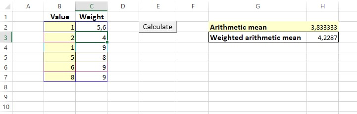

# ArithmeticMeanCalculator

## About
	Excel interactive sheet which allows to calculate arithmetic and weighted arithmetic mean.
	If weight values is not provided, only arithmetic mean will be calculated.
	If amout of weight != amout of value, weighted mean will be calculate only for values which have weight.

## Files
	- ArithmeticMeanCalculator.xlsm	(Excel sheet with working mean calculator)
	- CalculateMean.bas (File with VBA code, no needed for XLSM to work)
	